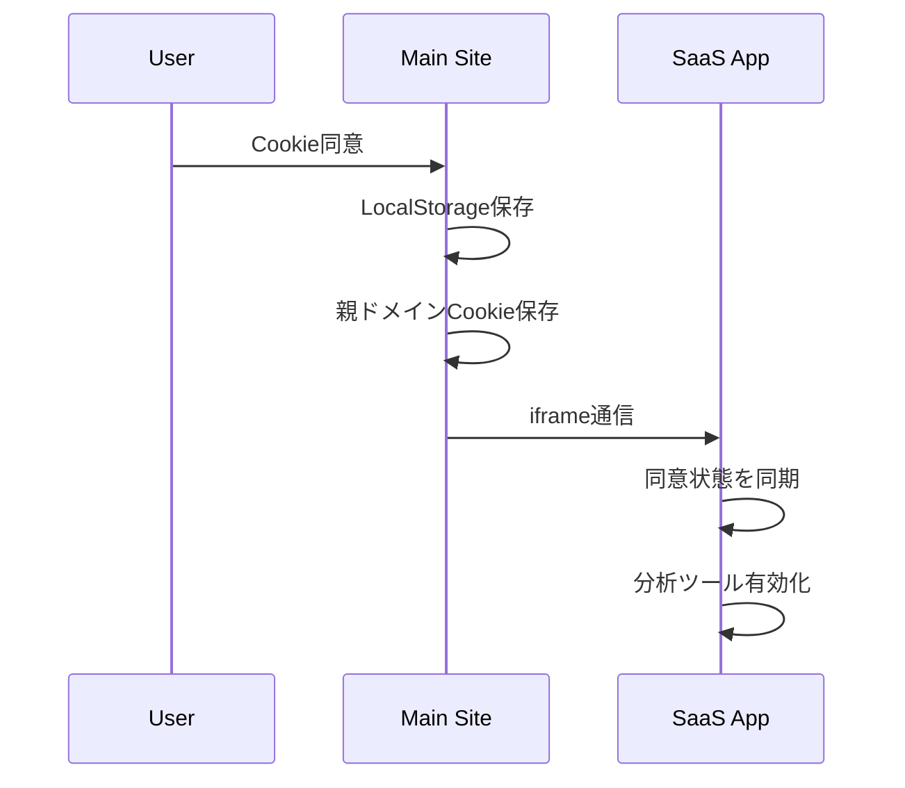
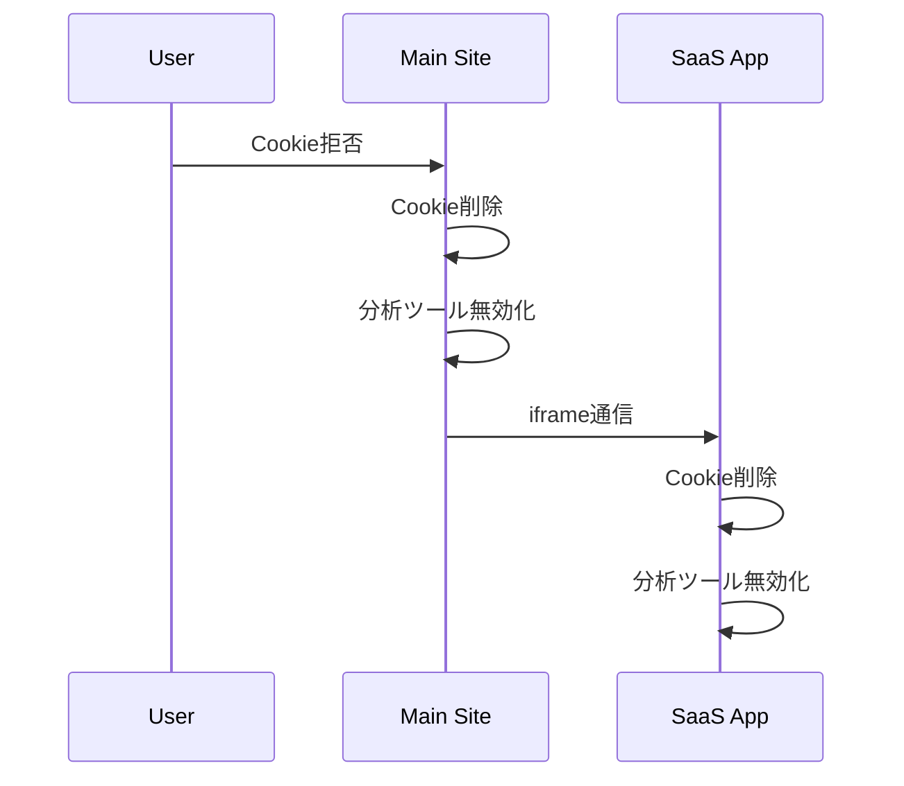

# サブドメイン間Cookie同意管理システム

## 概要

本システムは、メインドメインとサブドメイン間でCookie同意状態を統一管理し、ユーザーのプライバシー保護とUX向上を両立させるソリューションです。

## 🎯 解決する課題

### 従来の問題
- **重複バナー表示**: 各ドメインで個別のCookie同意バナーが表示される
- **同意状態の不整合**: ドメイン間で同意状態が同期されない
- **UX悪化**: ユーザーが何度も同意を求められる
- **法的リスク**: GDPR/CCPAの要件を満たせない可能性

### 本システムの解決策
- ✅ **統一管理**: 一度の同意で全ドメインに適用
- ✅ **双方向同期**: どのドメインで同意しても他に反映
- ✅ **プライバシー準拠**: 拒否時の完全なCookie削除
- ✅ **セキュリティ**: オリジン検証による安全な通信

## 🏗️ システム構成

### ドメイン構成例
```
truenorth.com          ← メインサイト（マーケティング）
├── app.truenorth.com  ← SaaSアプリケーション
├── api.truenorth.com  ← API（必要に応じて）
└── docs.truenorth.com ← ドキュメント（必要に応じて）
```

### アーキテクチャ図
```
┌─────────────────┐    ┌─────────────────┐
│  truenorth.com  │◄──►│app.truenorth.com│
│   (メインサイト)   │    │   (SaaSアプリ)    │
└─────────────────┘    └─────────────────┘
         ▲                        ▲
         │                        │
    ┌────────────────────────────────┐
    │    Cookie統一管理システム       │
    │  ・親ドメインCookie (.domain)  │
    │  ・localStorage (各ドメイン)   │
    │  ・postMessage API 通信        │
    └────────────────────────────────┘
```

## 🔧 技術仕様

### 1. Cookie管理戦略

#### 親ドメインCookie
```javascript
// 設定例
document.cookie = "cookieConsent=accepted; path=/; domain=.truenorth.com; max-age=31536000";
```

- **ドメインスコープ**: `.truenorth.com`（全サブドメインで有効）
- **有効期限**: 1年（31536000秒）
- **優先度**: 最高（他の保存方法より優先）

#### LocalStorage
```javascript
// 各ドメインで高速アクセス用
localStorage.setItem('cookieConsent', 'accepted');
```

- **用途**: 高速アクセス、フォールバック
- **スコープ**: ドメイン固有
- **優先度**: 低（親ドメインCookieが優先）

### 2. 通信プロトコル

#### postMessage API
```javascript
// メッセージ送信例
window.postMessage({
  type: 'COOKIE_CONSENT',
  accepted: true,
  source: 'maindomain'
}, 'https://app.truenorth.com');
```

#### iframe通信
```javascript
// クロスドメイン通信用
const iframe = document.createElement('iframe');
iframe.src = 'https://app.truenorth.com/cookie-sync?consent=true';
```

### 3. セキュリティ機能

#### オリジン検証
```javascript
const allowedOrigins = [
  'https://truenorth.com',
  'https://app.truenorth.com'
];

if (!allowedOrigins.includes(event.origin)) {
  return; // 不正なオリジンからの通信を拒否
}
```

## 📋 実装ガイド

### 1. ファイル構成

```
src/
├── components/
│   └── CookieConsent/
│       └── CookieConsent.astro     # メインコンポーネント
├── pages/
│   └── cookie-sync.astro           # 同期エンドポイント
└── docs/
    └── cookie-consent-cross-domain.md  # このドキュメント
```

### 2. 実装手順

#### Step 1: CookieConsentコンポーネントの設置
```astro
---
// Layout.astro
import CookieConsent from '../components/CookieConsent/CookieConsent.astro';
---

<!-- 各ページの末尾に追加 -->
<CookieConsent />
```

#### Step 2: 同期エンドポイントの設置
- `/cookie-sync.astro` をサブドメインにも配置
- URLパラメータで同意状態を受信
- postMessage APIで親ウィンドウに通知

#### Step 3: ドメイン設定の調整
```javascript
// 対象ドメインの設定（環境に応じて調整）
const subdomains = ['app', 'api', 'docs'];
const allowedOrigins = [
  'https://truenorth.com',
  'https://app.truenorth.com'
];
```

### 3. 動作フロー

#### 同意時の処理フロー


#### 拒否時の処理フロー


## 🔍 対応する分析ツール

### Google Analytics
- **Cookie**: `_ga`, `_gid`, `_gat_gtag_*`
- **制御**: 動的スクリプト読み込み/削除
- **完全停止**: スクリプト削除 + Cookie削除 + グローバル変数削除

### Microsoft Clarity
- **Cookie**: `_clck`, `_clsk`, `CLID`, `ANONCHK`, `SM`
- **制御**: 動的スクリプト読み込み/削除
- **完全停止**: `clarity('stop')` + スクリプト削除 + Cookie削除

### 追加可能な分析ツール
- **Hotjar**: `_hjid`, `_hjSessionUser_*`, `_hjSession_*`
- **Facebook Pixel**: `_fbp`, `_fbc`
- **Google Tag Manager**: 各種タグに応じたCookie制御

## 🛠️ カスタマイズガイド

### 1. ドメイン設定の変更

```javascript
// 新しいサブドメインを追加
const subdomains = ['app', 'api', 'docs', 'newapp'];

// 新しいドメインを許可リストに追加
const allowedOrigins = [
  'https://truenorth.com',
  'https://app.truenorth.com',
  'https://newapp.truenorth.com'
];
```

### 2. 分析ツールの追加

```javascript
// 新しい分析ツールの制御関数を追加
function toggleHotjar(enabled: boolean) {
  if (enabled) {
    // Hotjar初期化
  } else {
    // Hotjar無効化 + Cookie削除
    ['_hjid', '_hjSessionUser_*', '_hjSession_*'].forEach(deleteCookie);
  }
}

// saveCookieConsent関数に追加
if (accepted) {
  toggleHotjar(true);
} else {
  toggleHotjar(false);
}
```

### 3. Cookie削除範囲の拡張

```javascript
// より包括的なCookie削除
function deleteCookie(name: string) {
  const domains = [
    '',
    '.' + window.location.hostname,
    '.truenorth.com',  // 明示的に親ドメインも指定
  ];
  const paths = ['/', '/app/', '/api/'];
  
  domains.forEach(domain => {
    paths.forEach(path => {
      document.cookie = `${name}=; expires=Thu, 01 Jan 1970 00:00:00 GMT; path=${path}; domain=${domain}`;
    });
  });
}
```

## 🚨 トラブルシューティング

### よくある問題と解決策

#### 1. サブドメインで同意バナーが再表示される

**原因**: 親ドメインCookieの読み取り失敗
```javascript
// 解決策: デバッグログで確認
console.log('Parent domain cookie:', checkCookieConsentFromParent());
console.log('Local storage:', localStorage.getItem('cookieConsent'));
```

#### 2. クロスドメイン通信が失敗する

**原因**: CORS設定またはオリジン検証の問題
```javascript
// 解決策: オリジン確認
window.addEventListener('message', (event) => {
  console.log('Received message from:', event.origin);
  console.log('Allowed origins:', allowedOrigins);
});
```

#### 3. Cookie削除が不完全

**原因**: ドメイン・パス指定の不備
```javascript
// 解決策: より包括的な削除
function forceDeleteAllCookies() {
  document.cookie.split(';').forEach(cookie => {
    const name = cookie.split('=')[0].trim();
    if (name.includes('_ga') || name.includes('_clck')) {
      deleteCookie(name);
    }
  });
}
```

#### 4. 分析ツールが停止しない

**原因**: グローバル変数やスクリプトが残存
```javascript
// 解決策: 完全な削除確認
function verifyAnalyticsDisabled() {
  console.log('GA script exists:', !!document.querySelector('script[src*="googletagmanager.com"]'));
  console.log('Clarity script exists:', !!document.querySelector('script[src*="clarity.ms"]'));
  console.log('GA cookies:', document.cookie.match(/_ga[^;]*/g));
}
```

## 📊 パフォーマンス影響

### 通信オーバーヘッド
- **iframe作成**: ~10ms
- **同期通信**: ~100-300ms
- **総影響**: 初回のみ、体感できないレベル

### メモリ使用量
- **追加スクリプト**: ~2KB
- **iframe**: 一時的、自動削除
- **localStorage**: ~100bytes

## 🔒 プライバシー・セキュリティ

### GDPR準拠
- ✅ **明示的同意**: ユーザーの明確な意思確認
- ✅ **拒否権**: 簡単な拒否オプション
- ✅ **完全削除**: 拒否時の全Cookie削除
- ✅ **透明性**: デバッグログによる処理の可視化

### セキュリティ対策
- ✅ **オリジン検証**: 許可されたドメインからの通信のみ
- ✅ **入力検証**: URLパラメータの検証
- ✅ **XSS対策**: innerHTML使用の回避
- ✅ **CSRF対策**: 状態変更時のトークン確認（推奨）

## 🔮 将来の拡張可能性

### 1. 同意レベルの細分化
```javascript
// 必須・分析・マーケティングの分離
const consentLevels = {
  necessary: true,      // 常にtrue
  analytics: accepted,
  marketing: accepted
};
```

### 2. 同意履歴の管理
```javascript
// 同意変更の履歴を記録
const consentHistory = {
  timestamp: new Date().toISOString(),
  action: 'accepted',
  domain: window.location.hostname
};
```

### 3. A/Bテスト対応
```javascript
// バナーデザインの最適化
const bannerVariant = Math.random() > 0.5 ? 'compact' : 'detailed';
```

## 📚 参考資料

### 技術仕様
- [Web API - postMessage](https://developer.mozilla.org/docs/Web/API/Window/postMessage)
- [HTTP Cookies](https://developer.mozilla.org/docs/Web/HTTP/Cookies)
- [Same-origin policy](https://developer.mozilla.org/docs/Web/Security/Same-origin_policy)

### プライバシー法規
- [GDPR - Cookie同意要件](https://gdpr.eu/cookies/)
- [CCPA - プライバシー権利](https://oag.ca.gov/privacy/ccpa)
- [ePrivacy指令](https://eur-lex.europa.eu/legal-content/EN/TXT/?uri=CELEX:32002L0058)

### ベストプラクティス
- [IAB Europe - Consent Management Platform](https://iabeurope.eu/transparency-consent-framework/)
- [Google Analytics - Cookie使用](https://developers.google.com/analytics/devguides/collection/analyticsjs/cookie-usage)

---

## 🤝 サポート

### 技術的な質問
- システム実装: 開発チームに相談
- プライバシー要件: 法務チームに確認
- UX改善: デザインチームと協議

### 更新履歴
- v1.0: 基本実装完了
- v1.1: 双方向同期機能追加
- v1.2: セキュリティ強化

このドキュメントは実装状況に応じて継続的に更新されます。 